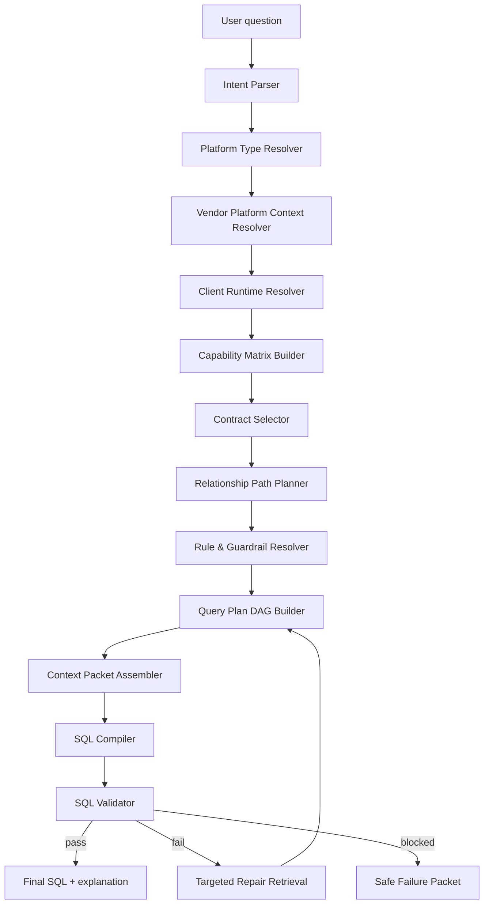

# ZenStatement Knowledge Base & SQL Compiler — End-to-End System Design

**Document status:** Review draft  
**Date:** 2026-05-29  
**Scope:** Knowledge base design, Cognee/cognify ingestion strategy, platform-type contexts, canonical cards, semantic contracts, client runtime bindings, multi-stage retrieval, query planning, SQL generation, validation, and rollout.

---

## 1. Executive summary

ZenStatement should not be designed as a one-shot RAG system that directly turns a user question into SQL. The problem is too structured and too risk-prone for that.

The recommended system is a **Semantic Contract Graph + Query Compiler**.

At a high level:

```text
Natural-language question
  → Intent IR
  → Platform Type Context resolution
  → Vendor Platform Context resolution
  → Client Runtime Binding resolution
  → Capability Matrix
  → Semantic Contract selection
  → Query Plan DAG
  → Certified joins / certified grains / certified filters
  → SQL generation
  → SQL validation
  → repair or safe failure
```

The key design move is to separate the knowledge base into layers:

```text
Universal commerce/accounting concepts
  ↓
Platform Type Context / Archetype Contract
  ↓
Vendor Platform Context / Canonical Cards
  ↓
Semantic Contracts generated from canonicals
  ↓
Client Runtime Binding / Capability Matrix
  ↓
Physical schema validation
  ↓
Query compiler and SQL validator
```

Cognee should be used as the **memory, graph, and retrieval substrate**. It should not be asked to directly answer complex SQL questions in one graph-completion call. Instead, Cognee should retrieve and traverse structured cards/contracts, while a deterministic planner assembles a compact, auditable SQL construction packet.

The system should optimize for:

1. **Safe routing:** only use tables that are active and bound for the selected client/account.
2. **Correct semantics:** use vendor-specific table, column, metric, relationship, and rule contracts.
3. **Cross-domain discipline:** use business flow bindings for marketplace → bank, D2C → logistics, OMS → WMS, payment gateway → bank, etc.
4. **Grain safety:** preaggregate many-side tables before joining.
5. **Explainability:** every SQL join, filter, metric, and output field should be traceable to a contract or runtime binding.
6. **Safe failure:** when required contracts or runtime join keys are missing, return a blocked/partial plan instead of hallucinated SQL.

---

## 2. Why the current one-shot pattern fails

The current failure mode is not merely poor retrieval. It is an architectural mismatch.

A complex ZenStatement question often requires the system to simultaneously determine:

- Which client is in scope.
- Which group/account/table bindings are active.
- Which platform type is relevant.
- Which vendor implementation applies.
- Which metric contracts apply.
- Which tables implement the required semantic roles.
- Which joins are documented and safe.
- Which tables must be preaggregated.
- Which active/scope filters are mandatory.
- Which columns need casts or normalization.
- Which cross-domain flow is permitted.
- Which output contract is appropriate.

A one-shot prompt asks the LLM to infer all of this at once. That works for simple metrics, but breaks when the query requires multiple CTEs, multiple table families, or cross-domain joins.

The system should instead behave like a compiler:

```text
Question → parse → resolve → plan → compile → validate
```

Not like a document chat system:

```text
Question → retrieve chunks → answer
```

---

## 3. Source-aligned design observations

The uploaded cards already point toward this design.

### 3.1 Vendor canonicals are semantic, not runtime

The Meesho, Myntra, and Nykaa marketplace documents are scoped as marketplace canonical cards. They contain vendor/platform semantics such as platform, platform context, domains, tables, columns, relationships, metrics, query patterns, rules, validation tests, output contracts, and execution constraints.

These should remain reusable vendor-level knowledge. They should not create tenant, group, platform account, payment account, logistics account, or bank account runtime entities.

### 3.2 Client packs are runtime bindings, not semantic canonicals

The Mensa, Ardeur, Astrotalk, and Teaxpress runtime packs define allowed runtime card types such as:

```text
tenant
group
platform_account
account_data_binding
business_scope_set
business_flow_binding
```

They explicitly keep runtime filters such as `group_id`, `group_level_id`, currency, and country inside account data bindings. Those values should not be pushed into generic platform/table/metric/process cards.

### 3.3 Cross-domain flows already exist as business flow bindings

For cases such as Teaxpress D2C COD/order logistics reconciliation, the runtime layer already models the flow as a `business_flow_binding` with participants like Shopify, Unicommerce, and logistics courier accounts. It also captures unresolved runtime requirements such as AWB/shipment join keys and brand-specific invoice handling.

This is exactly the pattern the planner should use for cross-domain reasoning.

### 3.4 Canonicals already contain contract-like material

Myntra has metrics, metric implementations, formula templates, matching logic, reconciliation profiles, query patterns, validation tests, output contracts, and execution constraints. Meesho has query guidance, output contracts, validation tests, execution constraints, and metric/query patterns. Nykaa contains similar marketplace semantics and query rules.

So the design should not abandon canonicals. It should **contractify** them.

---

## 4. Core design principle

The most important principle is:

> **Canonical cards are the source-of-truth knowledge objects. Semantic contracts are compiler-facing projections generated from canonical cards.**

So the flow is:

```text
Source documents
  → Canonical cards
  → Semantic contracts
  → Cognee DataPoints / graph nodes / graph edges
  → Retrieval packets
  → Query Plan DAG
  → SQL
```

Not:

```text
Source documents
  → chunks
  → one-shot SQL
```

And not:

```text
Triplets only
  → LLM guesses SQL behavior
```

Triplets are useful as a derived relationship index. They are not expressive enough to represent join conditions, cardinality, preaggregation policies, filter requirements, or safe failure rules.

---

## 5. Layered architecture

### 5.1 Full layer stack

```text
┌──────────────────────────────────────────────────────────────┐
│ Layer 0: Universal Commerce / Accounting Concepts             │
├──────────────────────────────────────────────────────────────┤
│ Layer 1: Platform Type Context / Archetype Contracts          │
├──────────────────────────────────────────────────────────────┤
│ Layer 2: Vendor Platform Context / Canonical Cards            │
├──────────────────────────────────────────────────────────────┤
│ Layer 3: Semantic Contracts / Execution-Facing Projections    │
├──────────────────────────────────────────────────────────────┤
│ Layer 4: Client Runtime Binding / Capability Matrix           │
├──────────────────────────────────────────────────────────────┤
│ Layer 5: Physical Schema / Live DB Validation                 │
├──────────────────────────────────────────────────────────────┤
│ Layer 6: Query Planner / SQL Compiler / Validator             │
└──────────────────────────────────────────────────────────────┘
```

### 5.2 Layer 0 — Universal commerce/accounting concepts

This layer contains domain-agnostic concepts:

```text
money
tax
invoice
settlement
payout
receivable
payable
refund
credit note
debit note
bank credit
bank debit
inventory movement
opening stock
closing stock
```

This layer should not know about Meesho, Myntra, Shopify, Unicommerce, Shiprocket, Razorpay, HDFC, or a client.

### 5.3 Layer 1 — Platform Type Context / Archetype Contract

This layer defines reusable domain grammar for classes of platforms.

Examples:

```text
platform_type_context.marketplace.seller_reconciliation
platform_type_context.marketplace.inventory
platform_type_context.d2c_oms.order_reconciliation
platform_type_context.wms.inventory_operations
platform_type_context.logistics.direct_carrier
platform_type_context.logistics.aggregator
platform_type_context.payment_gateway.payin_settlement
platform_type_context.bank.statement_reconciliation
platform_type_context.erp.accounting_mapping
platform_type_context.pos.restaurant_orders
platform_type_context.services.order_data
```

A platform type context should define:

```yaml
platform_type_context:
  id: platform_type_context.marketplace.seller_reconciliation
  platform_type: marketplace
  abstract_roles:
    - order_ledger
    - settlement_ledger
    - return_ledger
    - fee_ledger
    - tax_deduction_ledger
    - payout_summary
    - product_mapping
    - shipping_adjustment_ledger
  generic_reconciliation_patterns:
    - oms_to_settlement
    - return_to_reverse_settlement
    - settlement_to_bank
    - tax_deduction_summary
    - marketplace_shipping_true_up
  common_metric_families:
    - revenue
    - deductions
    - commissions
    - taxes
    - returns
    - receivables
    - settlement_variance
  generic_rules:
    - scope_filter_required_if_runtime_binding_has_scope_keys
    - active_filter_required_if_table_contract_has_active_flag
    - preaggregate_many_side_before_join
    - preserve_platform_sign_convention
    - do_not_join_on_shared_column_names_without_relationship_contract
```

This layer answers:

```text
What kind of business problem is this?
What abstract roles and patterns are usually involved?
What generic rules apply before vendor-specific details are known?
```

It does not define concrete Meesho/Myntra/Nykaa columns.

### 5.4 Layer 2 — Vendor Platform Context / Canonical Cards

This is your existing Meesho/Myntra/Nykaa/etc. layer.

It defines concrete vendor semantics:

```text
platform
platform_context
domain
table
column
relationship
value_profile
metric
metric_implementation
formula_template
business_process
workflow_step
state_transition
reconciliation_profile
reconciliation_side
reconciliation_unit
matching_logic
mismatch_category
query_pattern
rule
validation_test
output_contract
execution_constraint_set
```

Example role implementation:

```yaml
role_implementation:
  id: role_impl.meesho.order_ledger
  platform_context_id: platform_context.meesho.in
  abstract_role_id: abstract_role.marketplace.order_ledger
  table_id: table.zs_observe.meesho_sales
  field_mappings:
    order_id: order_id
    sub_order_id: sub_order_num
    gross_amount: charged_amount
    order_date: order_date
  caveats:
    - transaction_type may be null for older data
```

This layer answers:

```text
How does this vendor implement the abstract platform-type roles?
Which tables and columns represent each concept?
What vendor-specific rules, metrics, and joins apply?
```

### 5.5 Layer 3 — Semantic Contracts

Semantic contracts are generated from canonical cards.

They are not replacements for canonicals. They are executable, compiler-facing projections.

Contract families:

```text
TableUsageContract
ColumnUsageContract
RelationshipContract
MetricContract
MetricImplementationContract
ReconciliationContract
MatchingLogicContract
FlowContract
RuleContract
ValidationContract
OutputContract
ExecutionConstraintContract
```

Example relationship contract:

```yaml
relationship_contract:
  id: relationship_contract.meesho.sales_to_settlement
  source_table: table.zs_observe.meesho_sales
  target_table: table.zs_observe.meesho_settlement
  source_key: sub_order_num
  target_key: order_id
  join_condition: sales.sub_order_num = settlement.order_id
  default_join_type: left
  allowed_use_cases:
    - oms_settlement_reconciliation
    - sales_settlement_match
  forbidden_use_cases:
    - brand_enrichment
  grain_policy:
    source_grain: sub_order_line
    target_grain: settlement_line
    preaggregate_target_if_duplicates: true
  required_filters:
    - sales.is_active = true
    - settlement.is_active = true
  validation_tests:
    - relationship_keys_present
    - no_raw_many_side_amount_join
```

This layer answers:

```text
How may this knowledge be used in SQL?
What must be true before it is executable?
What does it forbid?
How should the validator check it?
```

### 5.6 Layer 4 — Client Runtime Binding / Capability Matrix

This is the client-specific layer.

It contains:

```text
tenant
group
platform_account
account_data_binding
business_scope_set
business_flow_binding
```

It should not contain generic platform/table/metric/reconciliation semantics.

Example account data binding:

```yaml
account_data_binding:
  id: account_data_binding.ardeur_fashion.meesho_in.primary.meesho_sales
  platform_account_id: platform_account.ardeur_fashion.meesho_in.primary
  table_id: table.zs_observe.meesho_sales
  status: active
  scope_keys:
    - column: group_id
      operator: =
      value: 65
      data_type: integer
    - column: group_level_id
      operator: =
      value: 221
      data_type: integer
```

From runtime bindings, build a capability matrix:

```yaml
capability_matrix:
  client: Ardeur Fashion Limited
  platform_account: platform_account.ardeur_fashion.meesho_in.primary
  platform_type_contexts:
    - marketplace.seller_reconciliation
  activated_roles:
    order_ledger:
      implemented_by: table.zs_observe.meesho_sales
      status: active
    settlement_ledger:
      implemented_by: table.zs_observe.meesho_settlement
      status: active
    return_ledger:
      implemented_by:
        - table.zs_observe.meesho_returns
        - table.zs_observe.meesho_reverse
      status: active
    fee_ledger:
      implemented_by:
        - table.zs_observe.meesho_forward_expenses
        - table.zs_observe.meesho_reverse_expenses
        - table.zs_observe.meesho_other_charges_expenses
      status: active_or_partial
  scope_filters:
    - group_id = 65
    - group_level_id = 221
```

This layer answers:

```text
What does this client actually have configured?
Which platform accounts are active?
Which tables are bound?
Which scope filters must be injected?
Which cross-domain flows are allowed?
Which items are active, draft, or review_required?
```

### 5.7 Layer 5 — Physical schema / live DB validation

This layer checks the actual database.

It answers:

```text
Does the table exist?
Does the column exist?
What is the data type?
Are there rows for this client scope?
Are status values as expected?
Are amount columns numeric or string?
Are sample joins viable?
```

This should be used after semantic planning, not as the semantic source of truth.

### 5.8 Layer 6 — Query planner / SQL compiler / validator

This layer turns a user question into a validated SQL plan.

It contains:

```text
Intent Parser
Platform Type Resolver
Vendor Context Resolver
Runtime Resolver
Capability Matrix Builder
Contract Selector
Relationship Path Planner
Query Plan DAG Builder
SQL Compiler
SQL AST Validator
Repair Loop
Safe Failure Handler
```

---

## 6. Canonicals vs contracts vs triplets

### 6.1 Canonical card

A canonical card is the evidence-preserving source-of-truth object.

It answers:

```text
What is this thing?
Where did it come from?
What does it mean?
What evidence supports it?
```

Example:

```yaml
candidate_card:
  card_type: table
  card_id: table.meesho_settlement
  name: meesho_settlement
  fields:
    business_purpose: Settlement & payout
    semantic_module: settlement
    grain: settlement_line_or_order_settlement_line
    join_key_candidates:
      - order_id
```

### 6.2 Semantic contract

A semantic contract is the execution-facing projection.

It answers:

```text
How may this thing be used?
What does it require?
What does it forbid?
What SQL behavior must follow?
What validation must pass?
What happens if it is missing?
```

Example:

```yaml
table_usage_contract:
  table_id: table.zs_observe.meesho_settlement
  allowed_roles:
    - seller_payout_source
    - return_logistics_cost_source
  mandatory_filters:
    - is_active = true
  grain: settlement_line
  join_policy:
    documented_relationships_only: true
    may_join_to:
      - table.zs_observe.meesho_sales
    documented_condition:
      - meesho_sales.sub_order_num = meesho_settlement.order_id
  preaggregation_policy:
    required_when:
      - joining to order grain
      - comparing settlement amounts
  forbidden_behavior:
    - do_not_join_on_shared_column_names_without_relationship_contract
```

### 6.3 Triplet

A triplet is a derived relationship index.

Example:

```text
relationship_contract.meesho.sales_to_settlement USES_SOURCE_TABLE table.zs_observe.meesho_sales
relationship_contract.meesho.sales_to_settlement USES_TARGET_TABLE table.zs_observe.meesho_settlement
relationship_contract.meesho.sales_to_settlement REQUIRES_FILTER is_active=true
```

Triplets are useful for:

```text
semantic search over relationships
neighborhood expansion
explainability
lightweight graph traversal
```

But triplets are not enough for SQL planning because they lose n-ary details like:

```text
join condition
source key
target key
allowed use case
forbidden use case
cardinality
preaggregation policy
required filters
validation tests
runtime status
```

The recommended model is:

```text
Canonical card → Semantic contract → Graph edges/triplets → Query plan
```

---

## 7. Platform Type Context design

### 7.1 Purpose

Platform Type Contexts define reusable business grammar across vendors.

They prevent duplication like this:

```text
Meesho has settlement
Myntra has settlement
Nykaa has settlement
Amazon has settlement
Flipkart has settlement
```

Instead, model:

```text
marketplace.seller_reconciliation DEFINES_ROLE settlement_ledger
Meesho IMPLEMENTS_ROLE settlement_ledger USING meesho_settlement
Myntra IMPLEMENTS_ROLE settlement_ledger USING myntra_settlement
Nykaa IMPLEMENTS_ROLE settlement_ledger USING nykaa_settlement
```

### 7.2 Suggested platform type contexts

```text
platform_type_context.marketplace.seller_reconciliation
platform_type_context.marketplace.inventory
platform_type_context.marketplace.fashion_mp
platform_type_context.marketplace.horizontal_mp
platform_type_context.marketplace.managed_fashion_marketplace
platform_type_context.d2c_oms.order_reconciliation
platform_type_context.wms.inventory_operations
platform_type_context.logistics.direct_carrier
platform_type_context.logistics.aggregator
platform_type_context.payment_gateway.payin_settlement
platform_type_context.bank.statement_reconciliation
platform_type_context.erp.accounting_mapping
platform_type_context.pos.restaurant_orders
platform_type_context.services.order_data
```

### 7.3 Example mappings

```yaml
platform_context.meesho.in:
  platform_type_context_ids:
    - platform_type_context.marketplace.seller_reconciliation
    - platform_type_context.marketplace.horizontal_mp

platform_context.myntra.in:
  platform_type_context_ids:
    - platform_type_context.marketplace.seller_reconciliation
    - platform_type_context.marketplace.fashion_mp

platform_context.nykaa_fashion.in:
  platform_type_context_ids:
    - platform_type_context.marketplace.seller_reconciliation
    - platform_type_context.marketplace.managed_fashion_marketplace

platform_context.shopify.in_and_global.d2c_oms_client_config:
  platform_type_context_ids:
    - platform_type_context.d2c_oms.order_reconciliation

platform_context.unicommerce.in.d2c_oms:
  platform_type_context_ids:
    - platform_type_context.d2c_oms.order_reconciliation
    - platform_type_context.wms.inventory_operations

platform_context.shiprocket.in:
  platform_type_context_ids:
    - platform_type_context.logistics.aggregator

platform_context.delhivery.in:
  platform_type_context_ids:
    - platform_type_context.logistics.direct_carrier

platform_context.razorpay.in:
  platform_type_context_ids:
    - platform_type_context.payment_gateway.payin_settlement

platform_context.hdfc_bank.in:
  platform_type_context_ids:
    - platform_type_context.bank.statement_reconciliation
```

### 7.4 Abstract role model

```yaml
abstract_role:
  id: abstract_role.marketplace.order_ledger
  platform_type_context_id: platform_type_context.marketplace.seller_reconciliation
  meaning: Source of expected forward order/order-line facts
  required_capabilities:
    - order_id
    - order_date
    - amount
    - status_or_transaction_type
```

### 7.5 Role implementation model

```yaml
role_implementation:
  id: role_impl.nykaa.settlement_ledger
  platform_context_id: platform_context.nykaa_fashion.in
  abstract_role_id: abstract_role.marketplace.settlement_ledger
  table_id: table.nykaa_settlement
  key_columns:
    order_id: order_id
    invoice_number: invoice_number
    item_id: item_id
  amount_columns:
    settled_amount: settled_amount
    actual_settlement: actual_settlement
  mandatory_filters:
    - is_active = true
```

### 7.6 Inheritance pattern

```text
PlatformTypeContract
  ↓ implemented by
PlatformContextContract
  ↓ activated by
ClientRuntimeBinding
```

Example:

```yaml
platform_type_contract:
  id: contract_type.marketplace.oms_to_settlement
  abstract_expected_side:
    role: order_ledger
    required_fields:
      - order_id
      - gross_amount
      - order_date
  abstract_actual_side:
    role: settlement_ledger
    required_fields:
      - order_id
      - settled_amount
      - settlement_date
  generic_mismatch_categories:
    - missing_in_settlement
    - amount_mismatch
    - timing_gap
```

Meesho implementation:

```yaml
platform_context_contract:
  id: contract.meesho.oms_to_settlement
  inherits: contract_type.marketplace.oms_to_settlement
  expected_side:
    table: table.meesho_sales
    key: sub_order_num
    amount: charged_amount
  actual_side:
    table: table.meesho_settlement
    key: order_id
    amount: settled_amount
  join_condition:
    sales.sub_order_num = settlement.order_id
```

---

## 8. Semantic contract taxonomy

### 8.1 TableUsageContract

```yaml
table_usage_contract:
  id: table_contract.meesho.sales
  table_id: table.zs_observe.meesho_sales
  platform_context_id: platform_context.meesho.in
  abstract_role_ids:
    - abstract_role.marketplace.order_ledger
  business_role: forward_oms
  grain: sub_order_line
  mandatory_filters:
    - is_active = true
  runtime_scope_required:
    - group_id
    - group_level_id
  primary_date_candidates:
    - order_date
    - created_date
  safe_join_keys:
    - sub_order_num
    - order_id
  unsafe_join_notes:
    - do not infer settlement joins from shared names; use relationship contracts
```

### 8.2 ColumnUsageContract

```yaml
column_usage_contract:
  id: column_contract.myntra_oms.mrp
  table_id: table.zs_observe.myntra_oms
  column_name: mrp
  semantic_role: amount
  physical_type: string
  cast_required_for_math: true
  recommended_cast: TRY_CAST(mrp AS DOUBLE)
  allowed_uses:
    - gross_sales
    - discount_analysis
  validation_tests:
    - cast_present_if_used_in_sum
```

### 8.3 RelationshipContract

```yaml
relationship_contract:
  id: relationship_contract.myntra.oms_to_settlement
  source_table: table.zs_observe.myntra_oms
  target_table: table.zs_observe.myntra_settlement
  source_columns:
    - order_code
    - invoice_number
  target_columns:
    - order_id
    - invoice_number
  join_condition: oms.order_code = settlement.order_id AND oms.invoice_number = settlement.invoice_number
  relationship_type: marketplace_internal_join
  join_safety: preaggregate settlement by order_id/invoice_number before amount comparison when using raw tables
  allowed_use_cases:
    - oms_settlement_reconciliation
  forbidden_use_cases:
    - non_order_settlement_join
```

### 8.4 MetricContract

```yaml
metric_contract:
  id: metric.net_revenue
  aliases:
    - net revenue
    - net GMV
    - GMV minus returns
  metric_family: revenue
  semantic_definition: gross_forward_gmv_minus_reverse_amount
  default_unit: INR
  allowed_grains:
    - marketplace
    - day
    - month
    - brand
    - sku
```

### 8.5 MetricImplementationContract

```yaml
metric_implementation_contract:
  id: metric_impl.meesho.net_revenue
  metric_id: metric.net_revenue
  platform_context_id: platform_context.meesho.in
  source_tables:
    - table.zs_observe.meesho_sales
    - table.zs_observe.meesho_reverse
  formula_dag:
    gross_forward_gmv:
      table: table.zs_observe.meesho_sales
      expression: SUM(charged_amount)
      filters:
        - is_active = true
    reverse_gmv:
      table: table.zs_observe.meesho_reverse
      expression: SUM(charged_amount)
      filters:
        - is_active = true
    net_revenue:
      expression: gross_forward_gmv - reverse_gmv
  grain_alignment:
    aggregate_each_side_before_join: true
```

### 8.6 ReconciliationContract

```yaml
reconciliation_contract:
  id: recon.meesho.sales_vs_settlement
  platform_context_id: platform_context.meesho.in
  pattern_id: contract_type.marketplace.oms_to_settlement
  expected_side:
    role: order_ledger
    table: table.zs_observe.meesho_sales
    key: sub_order_num
    amount: charged_amount
    filters:
      - is_active = true
  actual_side:
    role: settlement_ledger
    table: table.zs_observe.meesho_settlement
    key: order_id
    amount_candidates:
      - sale_settled_amount
      - settled_amount
    filters:
      - is_active = true
  match_logic:
    join_condition: expected.sub_order_num = actual.order_id
    join_type: left
  variance_logic:
    expression: actual.sale_settled_amount - expected.charged_amount
  mismatch_categories:
    - missing_settlement
    - amount_mismatch
    - timing_gap
  preaggregation:
    actual_side: aggregate_by_order_id_if_duplicates
```

### 8.7 FlowContract

```yaml
flow_contract:
  id: flow.teaxpress.d2c_cod_to_logistics_settlement
  flow_type: d2c_cod_to_logistics_settlement
  expected_participant_roles:
    oms_source:
      - shopify
      - unicommerce
    logistics_sources:
      - bluedart
      - ekart
      - delhivery
      - xpressbees
      - dtdc
      - india_post
  required_runtime_resolution:
    - AWB/shipment join keys
    - brand-specific invoice variant handling
  routing_rule:
    use_only_canonical_courier_bindings_for_automated_routing
```

### 8.8 RuleContract

```yaml
rule_contract:
  id: rule.meesho.active_filter
  rule_type: mandatory_filter
  applies_to:
    - table.zs_observe.meesho_sales
    - table.zs_observe.meesho_settlement
    - table.zs_observe.meesho_reverse
  sql_predicate: is_active = true
  severity: blocking
  compiler_stage:
    - table_scan
    - validation
```

### 8.9 ValidationContract

```yaml
validation_contract:
  id: validation.no_raw_many_side_amount_join
  validation_type: sql_ast_guardrail
  severity: blocking
  check:
    - if table has grain many_side and participates in amount comparison
    - then it must be preaggregated before join
  failure_message: Many-side table joined raw into amount comparison. Add aggregation CTE first.
```

### 8.10 OutputContract

```yaml
output_contract:
  id: output_contract.marketplace.reconciliation_result
  output_fields:
    - order_id
    - expected_amount
    - actual_amount
    - variance_amount
    - recon_status
    - mismatch_category
  required_metadata:
    - source_table
    - filters_applied
    - runtime_scope
```

---

## 9. Cognee / cognify design strategy

### 9.1 Design principle

Cognee should not infer operational SQL semantics from raw prose at query time.

Instead:

```text
Generate structured DataPoints first.
Cognify structured DataPoints.
Retrieve contracts and graph neighborhoods.
Assemble deterministic context packets.
Compile SQL from packets.
```

### 9.2 Recommended ingestion approaches

#### Option A — structured markdown/YAML + custom extraction prompt

Keep markdown authoring, but add explicit contract blocks:

```yaml
semantic_contract:
  contract_id: contract.meesho.net_revenue
  contract_type: metric_implementation_contract
  produces_metric: metric.net_revenue
  source_tables:
    - table.zs_observe.meesho_sales
    - table.zs_observe.meesho_reverse
  required_filters:
    - table.zs_observe.meesho_sales.is_active = true
    - table.zs_observe.meesho_reverse.is_active = true
  formula:
    gross_gmv_minus_reverse_charged_amount
  output_grain:
    - requested_time_grain
    - requested_dimension_grain
  validation_tests:
    - active_filters_present
    - no_sign_inversion
```

Then use a custom graph model / custom prompt to constrain graph extraction.

#### Option B — generate custom DataPoints directly

This is the stronger approach.

Generate typed contract DataPoints before sending data into Cognee.

Example pseudo-model:

```python
class MetricImplementationContract(DataPoint):
    contract_id: str
    metric_id: str
    platform_context_id: str
    source_table_ids: list[str]
    source_columns: list[str]
    formula_expression: str
    required_filters: list[str]
    grain: str
    validation_test_ids: list[str]

    metadata = {
        "index_fields": [
            "contract_id",
            "metric_id",
            "formula_expression"
        ],
        "identity_fields": ["contract_id"]
    }
```

Use this when SQL generation depends on deterministic fields.

### 9.3 What to index

Do not embed every property.

Index natural-language retrieval surfaces:

```yaml
retrieval_surface:
  name: Return logistics cost
  aliases:
    - return shipping cost
    - reverse logistics charge
    - RTO logistics cost
  natural_language_patterns:
    - marketplace return logistics cost query
    - return cost by month
    - RTO charge analysis
```

Keep execution-critical fields as structured properties:

```yaml
execution_surface:
  source_tables:
    - table.zs_observe.meesho_settlement
  required_filters:
    - is_active = true
    - order_status IN ('Return', 'RTO')
  formula_expression:
    - SUM(return_logistic_charge_excluding_tax)
    - SUM(return_logistic_charge_gst)
  preaggregation:
    required_before_joining_to_order_or_brand_grain
```

### 9.4 Derived graph edges

Each contract should emit typed edges.

Example:

```text
MetricImplementationContract PRODUCES_METRIC Metric
MetricImplementationContract USES_TABLE Table
MetricImplementationContract USES_COLUMN Column
MetricImplementationContract REQUIRES_RULE Rule
MetricImplementationContract REQUIRES_VALIDATION ValidationTest
RelationshipContract HAS_SOURCE_TABLE Table
RelationshipContract HAS_TARGET_TABLE Table
RelationshipContract REQUIRES_PREAGGREGATION Rule
RuntimeBindingContract BINDS_TO_TABLE Table
BusinessFlowBinding HAS_FLOW_PARTICIPANT PlatformAccount
BusinessFlowBinding USES_BUSINESS_SCOPE_SET BusinessScopeSet
```

### 9.5 Use triplet embeddings as a secondary index

For relationship-heavy search, enable triplet embeddings where supported.

But use them as a retrieval aid, not as the source model.

```text
Source model: contract objects
Derived index: triplets
Execution model: Query Plan DAG
```

### 9.6 Node sets / datasets

Use separate node sets or datasets for clean retrieval boundaries:

```text
canonical.platform_type.marketplace
canonical.platform_type.d2c_oms
canonical.platform_type.logistics
canonical.platform_type.payment_gateway
canonical.platform_type.bank

canonical.vendor.meesho
canonical.vendor.myntra
canonical.vendor.nykaa
canonical.vendor.shopify
canonical.vendor.unicommerce
canonical.vendor.shiprocket
canonical.vendor.delhivery

client.mensa
client.ardeur
client.astrotalk
client.teaxpress

contracts.metric
contracts.relationship
contracts.reconciliation
contracts.flow
contracts.validation
```

### 9.7 Search mode strategy

Use Cognee search modes by stage, not one mode for everything.

| Stage | Preferred retrieval style | Purpose |
|---|---|---|
| Runtime resolver | graph traversal / exact card retrieval | Resolve client, platform account, bindings, scope filters |
| Platform type resolver | summaries / graph completion context | Identify abstract role/pattern family |
| Vendor context resolver | chunks + graph | Retrieve concrete vendor semantics |
| Contract selector | graph traversal + semantic search | Select metric/recon/relationship/rule contracts |
| Join path planner | deterministic graph traversal | Connect tables through documented relationships only |
| SQL packet assembly | deterministic assembler | Produce compact context packet |
| SQL repair | targeted chunk/graph retrieval | Fetch missing rule/contract only |

Important rule:

```text
Use LLM-based graph completion for candidate discovery.
Use deterministic traversal for final table/path/contract selection.
```

---

## 10. Runtime capability matrix

### 10.1 Purpose

The capability matrix prevents global semantic knowledge from being used for a client that does not have the required tables active.

It answers:

```text
Can this client execute this query safely?
Which abstract roles are active?
Which tables implement them?
What filters must be injected?
Which capabilities are missing or blocked?
```

### 10.2 Capability matrix shape

```yaml
capability_matrix:
  tenant_id: tenant.ardeur_fashion
  group_id: group.ardeur_fashion.zeal_bizfashion_ventures
  platform_account_id: platform_account.ardeur_fashion.meesho_in.primary
  platform_context_id: platform_context.meesho.in
  platform_type_context_ids:
    - platform_type_context.marketplace.seller_reconciliation

  runtime_scope:
    filters:
      - column: group_id
        operator: =
        value: 65
      - column: group_level_id
        operator: =
        value: 221

  active_role_implementations:
    order_ledger:
      table_id: table.zs_observe.meesho_sales
      binding_id: account_data_binding.ardeur_fashion.meesho_in.primary.meesho_sales
      status: active
    settlement_ledger:
      table_id: table.zs_observe.meesho_settlement
      binding_id: account_data_binding.ardeur_fashion.meesho_in.primary.meesho_settlement
      status: active
    return_ledger:
      table_ids:
        - table.zs_observe.meesho_reverse
        - table.zs_observe.meesho_returns
      status: active

  unavailable_capabilities:
    external_logistics_invoice_reconciliation:
      status: not_configured
      reason: no logistics settlement files configured
```

### 10.3 Hard gates

Reject or block SQL generation when:

```text
required table is not runtime-bound
binding status is draft or review_required
required platform_context is missing
relationship contract is missing
forbidden join contract is triggered
required runtime join key is missing
scope filters are unavailable
physical schema validation fails
```

---

## 11. Multi-stage query pipeline

### 11.1 Pipeline overview



### 11.2 Stage 1 — Intent Parser

Convert the question into a strict IR.

Example:

```yaml
intent_ir:
  original_question: For Ardeur on Meesho, show brand-level GMV, returns, return logistics cost, and net revenue by month.
  client:
    name: Ardeur Fashion Limited
  platform_hint:
    vendor: Meesho
    platform_type: marketplace
  domain_family:
    - marketplace_reconciliation
    - returns
    - revenue
  requested_metrics:
    - gross_gmv
    - return_gmv
    - return_logistics_cost
    - net_revenue
  dimensions:
    - month
    - brand
  date_range: null
  output_grain:
    - month
    - brand
  complexity_flags:
    requires_multiple_ctes: true
    requires_dimension_enrichment: true
    requires_runtime_scope: true
    requires_join_path: true
```

### 11.3 Stage 2 — Platform Type Resolver

Map intent to an archetype:

```yaml
platform_type_resolution:
  selected_contexts:
    - platform_type_context.marketplace.seller_reconciliation
  selected_abstract_roles:
    - order_ledger
    - settlement_ledger
    - return_ledger
    - product_mapping
  selected_patterns:
    - marketplace_metric_with_returns
    - marketplace_metric_with_dimension_enrichment
```

### 11.4 Stage 3 — Vendor Platform Context Resolver

Select concrete vendor context:

```yaml
vendor_context_resolution:
  platform_context_id: platform_context.meesho.in
  selected_domains:
    - domain.meesho.orders
    - domain.meesho.returns
    - domain.meesho.settlement
    - domain.meesho.mapping_enrichment
    - domain.meesho.query_guidance
```

### 11.5 Stage 4 — Client Runtime Resolver

Resolve client runtime:

```yaml
runtime_resolution:
  tenant_id: tenant.ardeur_fashion
  group_id: group.ardeur_fashion.zeal_bizfashion_ventures
  platform_account_id: platform_account.ardeur_fashion.meesho_in.primary
  scope_filters:
    - group_id = 65
    - group_level_id = 221
  active_bindings:
    - table.zs_observe.meesho_sales
    - table.zs_observe.meesho_settlement
    - table.zs_observe.meesho_returns
    - table.zs_observe.meesho_reverse
    - table.zs_observe.meesho_forward_expenses
    - table.zs_observe.meesho_reverse_expenses
    - table.zs_observe.meesho_other_charges_expenses
```

### 11.6 Stage 5 — Contract Selector

Select metric, relationship, rule, and output contracts.

```yaml
selected_contracts:
  metrics:
    - metric_impl.meesho.gross_gmv
    - metric_impl.meesho.return_gmv
    - metric_impl.meesho.return_logistics_cost
    - metric_impl.meesho.net_revenue
  relationships:
    - relationship_contract.meesho.sales_to_brand_mapping
    - relationship_contract.meesho.reverse_to_brand_mapping
    - relationship_contract.meesho.sales_to_settlement
  rules:
    - rule.meesho.active_filter
    - rule.runtime.scope_filter_required
    - rule.preaggregate_many_side_before_join
    - rule.brand_sku_mapping_required
  output_contract:
    - output_contract.marketplace.metric_by_month_brand
```

### 11.7 Stage 6 — Relationship Path Planner

Build a join graph only from documented relationships.

Scoring example:

```yaml
edge_score:
  same_platform_context: +100
  documented_relationship_contract: +100
  exact_metric_source_table: +80
  same_grain: +40
  preaggregation_required: -30
  review_required_edge: -100
  forbidden_join: -1000
```

Hard rule:

```text
No join may appear in SQL unless it is certified by a RelationshipContract, MatchingLogicContract, FlowContract, or explicit query pattern.
```

### 11.8 Stage 7 — Rule and guardrail resolver

Retrieve and apply:

```text
mandatory filters
active-row filters
runtime scope filters
cast rules
status normalization rules
sign conventions
many-side preaggregation rules
no-join rules
do-not-use column rules
safe failure rules
```

### 11.9 Stage 8 — Query Plan DAG Builder

Build a plan before SQL.

```yaml
query_plan_dag:
  nodes:
    sales_base:
      type: table_scan
      table: table.zs_observe.meesho_sales
      filters:
        - is_active = true
        - group_id = 65
        - group_level_id = 221
      output_grain: sub_order_line

    brand_mapping_base:
      type: table_scan
      table: table.zs_observe.meesho_brand_mapping
      filters:
        - is_active = true
        - group_id = 65
        - group_level_id = 221
      output_grain: order_mapping_line

    sales_with_brand:
      type: join
      left: sales_base
      right: brand_mapping_base
      join_certificate: join_cert.meesho.sales_brand_mapping
      output_grain: sub_order_line_with_brand

    sales_by_month_brand:
      type: aggregate
      source: sales_with_brand
      group_by:
        - month
        - brand
      measures:
        - gross_gmv

    reverse_base:
      type: table_scan
      table: table.zs_observe.meesho_reverse
      filters:
        - is_active = true
        - group_id = 65
        - group_level_id = 221
      output_grain: reverse_sub_order_line

    reverse_by_month_brand:
      type: aggregate
      source: reverse_base_joined_to_brand_mapping
      group_by:
        - month
        - brand
      measures:
        - return_gmv

    return_logistics_by_month:
      type: aggregate
      source: table.zs_observe.meesho_settlement
      filters:
        - is_active = true
        - order_status IN ('Return', 'RTO')
        - group_id = 65
        - group_level_id = 221
      group_by:
        - month
      measures:
        - return_logistics_cost

    final:
      type: join_aggregates
      join_keys:
        - month
        - brand
      measures:
        - gross_gmv
        - return_gmv
        - return_logistics_cost
        - net_revenue
```

### 11.10 Stage 9 — Context Packet Assembler

The SQL LLM should receive a compact packet, not raw chunks.

```yaml
sql_context_packet:
  dialect: athena_trino
  intent: ...
  runtime: ...
  capability_matrix: ...
  tables: ...
  metrics: ...
  relationships: ...
  rules: ...
  output_contract: ...
  validation_requirements: ...
```

### 11.11 Stage 10 — SQL Compiler

Compile from Query Plan DAG to SQL.

SQL shape should be predictable:

```sql
WITH
sales_base AS (...),
sales_with_brand AS (...),
sales_by_month_brand AS (...),
reverse_base AS (...),
reverse_with_brand AS (...),
reverse_by_month_brand AS (...),
return_logistics_by_month AS (...),
final AS (...)
SELECT * FROM final;
```

### 11.12 Stage 11 — SQL Validator

Validate SQL against contracts.

Validation groups:

```yaml
validation:
  table_routing:
    - every table is runtime-bound
    - every binding is active
  filters:
    - scope filters applied to every scoped table
    - active filters applied where required
  joins:
    - every join has a join certificate
    - no undocumented shared-key join
    - no forbidden non-order join
  grain:
    - many-side tables preaggregated before joining
    - final GROUP BY matches requested output grain
  columns:
    - no do_not_use columns
    - casts applied where required
  semantics:
    - sign convention preserved
    - status normalization applied where required
    - output contract satisfied
```

### 11.13 Stage 12 — Repair or safe failure

If validation fails, do targeted retrieval.

Examples:

```text
Need missing relationship contract for table A → table B.
Need cast rule for amount column X.
Need platform-context implementation for abstract role settlement_ledger.
Need runtime binding for table Y.
```

If the missing piece is blocking, return:

```yaml
plan_status: blocked
reason:
  - required_runtime_resolution_missing
missing:
  - AWB/shipment join key between Shopify/Unicommerce and courier settlement
  - brand-specific invoice variant handling
suggested_action:
  - add logistics join-key contract
  - add invoice variant mapping contract
```

---

## 12. Certified planning objects

### 12.1 JoinCertificate

Every SQL join should have a certificate.

```yaml
join_certificate:
  id: join_cert.meesho.sales_settlement
  sql_join:
    left: table.zs_observe.meesho_sales
    right: table.zs_observe.meesho_settlement
    condition: sales.sub_order_num = settlement.order_id
  certified_by:
    relationship_contract: relationship_contract.meesho.sales_to_settlement
    matching_logic: matching_logic.meesho.sales_settlement_match
  safety_checks:
    documented_join: pass
    grain_safe: pass_with_preaggregation
    runtime_bound_tables: pass
    forbidden_join: pass
```

### 12.2 GrainCertificate

Every CTE should declare grain.

```yaml
grain_certificate:
  cte_name: settlement_by_order
  source_table: table.zs_observe.meesho_settlement
  input_grain: settlement_line
  output_grain: order_id
  aggregation:
    group_by:
      - order_id
    measures:
      - SUM(settled_amount)
      - SUM(return_logistic_charge_excluding_tax)
  reason:
    - required before joining to OMS/reverse order grain
```

### 12.3 FilterCertificate

Every table scan should declare filters.

```yaml
filter_certificate:
  cte_name: sales_base
  table: table.zs_observe.meesho_sales
  mandatory_filters:
    - is_active = true
  runtime_filters:
    - group_id = 65
    - group_level_id = 221
  certified_by:
    - table_usage_contract.meesho.sales
    - account_data_binding.ardeur_fashion.meesho_in.primary.meesho_sales
```

### 12.4 MetricCertificate

Every output metric should trace back to a metric implementation.

```yaml
metric_certificate:
  output_field: net_revenue
  metric_id: metric.net_revenue
  implementation_id: metric_impl.meesho.net_revenue
  formula: gross_gmv - return_gmv
  source_measures:
    - gross_gmv
    - return_gmv
```

---

## 13. SQL context packet format

Use this packet as the LLM input for SQL generation.

```yaml
sql_context_packet:
  packet_id: packet.ardeur.meesho.brand_month_revenue_returns.v1
  dialect: athena_trino

  user_question:
    raw: For Ardeur on Meesho, show brand-level GMV, returns, return logistics cost, and net revenue by month.

  intent:
    client: Ardeur Fashion Limited
    platform: Meesho
    platform_type_context: marketplace.seller_reconciliation
    domain_families:
      - revenue
      - returns
      - settlement
      - mapping_enrichment
    requested_metrics:
      - gross_gmv
      - return_gmv
      - return_logistics_cost
      - net_revenue
    dimensions:
      - month
      - brand

  runtime:
    tenant_id: tenant.ardeur_fashion
    group_id: group.ardeur_fashion.zeal_bizfashion_ventures
    platform_account_id: platform_account.ardeur_fashion.meesho_in.primary
    scope_filters:
      - table_alias: '*'
        predicate: group_id = 65
      - table_alias: '*'
        predicate: group_level_id = 221

  table_scans:
    sales:
      table: zs_observe.meesho_sales
      role: order_ledger
      grain: sub_order_line
      mandatory_filters:
        - is_active = true
      date_column: order_date
      amount_columns:
        gross_gmv: charged_amount

    reverse:
      table: zs_observe.meesho_reverse
      role: return_ledger
      grain: reverse_sub_order_line
      mandatory_filters:
        - is_active = true
      date_column: order_date
      amount_columns:
        return_gmv: charged_amount

    settlement:
      table: zs_observe.meesho_settlement
      role: settlement_ledger
      grain: settlement_line
      mandatory_filters:
        - is_active = true
      return_filter:
        - order_status IN ('Return', 'RTO')
      amount_columns:
        return_logistics_cost: return_logistic_charge_excluding_tax

    brand_mapping:
      table: zs_observe.meesho_brand_mapping
      role: product_mapping
      grain: order_mapping_line
      mandatory_filters:
        - is_active = true
      columns:
        brand: brand
        order_id: order_id

  relationships:
    - id: relationship_contract.meesho.sales_to_brand_mapping
      left: sales
      right: brand_mapping
      condition: sales.order_id = brand_mapping.order_id
      join_type: left
    - id: relationship_contract.meesho.reverse_to_brand_mapping
      left: reverse
      right: brand_mapping
      condition: reverse.order_id = brand_mapping.order_id
      join_type: left

  rules:
    - active_filter_required
    - runtime_scope_filter_required
    - no_raw_many_side_join
    - preserve_sign_convention
    - no_undocumented_join

  output_contract:
    grain:
      - month
      - brand
    fields:
      - month
      - brand
      - gross_gmv
      - return_gmv
      - return_logistics_cost
      - net_revenue
```

---

## 14. Example SQL skeleton from the packet

The compiler can produce SQL like this shape.

```sql
WITH
sales_base AS (
  SELECT
    DATE_TRUNC('month', order_date) AS month,
    order_id,
    sub_order_num,
    charged_amount
  FROM zs_observe.meesho_sales
  WHERE is_active = true
    AND group_id = 65
    AND group_level_id = 221
),

brand_mapping_base AS (
  SELECT
    order_id,
    brand
  FROM zs_observe.meesho_brand_mapping
  WHERE is_active = true
    AND group_id = 65
    AND group_level_id = 221
),

sales_by_month_brand AS (
  SELECT
    s.month,
    COALESCE(b.brand, 'Unmapped') AS brand,
    SUM(s.charged_amount) AS gross_gmv
  FROM sales_base s
  LEFT JOIN brand_mapping_base b
    ON s.order_id = b.order_id
  GROUP BY 1, 2
),

reverse_base AS (
  SELECT
    DATE_TRUNC('month', order_date) AS month,
    order_id,
    sub_order_num,
    charged_amount
  FROM zs_observe.meesho_reverse
  WHERE is_active = true
    AND group_id = 65
    AND group_level_id = 221
),

reverse_by_month_brand AS (
  SELECT
    r.month,
    COALESCE(b.brand, 'Unmapped') AS brand,
    SUM(r.charged_amount) AS return_gmv
  FROM reverse_base r
  LEFT JOIN brand_mapping_base b
    ON r.order_id = b.order_id
  GROUP BY 1, 2
),

return_logistics_by_month AS (
  SELECT
    DATE_TRUNC('month', settlement_date) AS month,
    SUM(return_logistic_charge_excluding_tax) AS return_logistics_cost
  FROM zs_observe.meesho_settlement
  WHERE is_active = true
    AND group_id = 65
    AND group_level_id = 221
    AND order_status IN ('Return', 'RTO')
  GROUP BY 1
),

brand_months AS (
  SELECT month, brand FROM sales_by_month_brand
  UNION
  SELECT month, brand FROM reverse_by_month_brand
),

final AS (
  SELECT
    bm.month,
    bm.brand,
    COALESCE(s.gross_gmv, 0) AS gross_gmv,
    COALESCE(r.return_gmv, 0) AS return_gmv,
    COALESCE(rl.return_logistics_cost, 0) AS return_logistics_cost,
    COALESCE(s.gross_gmv, 0) - COALESCE(r.return_gmv, 0) AS net_revenue
  FROM brand_months bm
  LEFT JOIN sales_by_month_brand s
    ON bm.month = s.month AND bm.brand = s.brand
  LEFT JOIN reverse_by_month_brand r
    ON bm.month = r.month AND bm.brand = r.brand
  LEFT JOIN return_logistics_by_month rl
    ON bm.month = rl.month
)

SELECT *
FROM final
ORDER BY month, brand;
```

Important: this is a skeleton. The actual compiler should validate the exact date columns, physical column names, and whether `return_logistics_by_month` can safely be allocated to brand. If the source table cannot attribute return logistics to brand, the compiler should either:

1. return return logistics at month grain only, or
2. allocate only if a certified join path to brand exists, or
3. block brand-level allocation with an explanation.

---

## 15. Cross-domain flows

### 15.1 Why cross-domain flows need explicit flow bindings

Do not infer cross-domain joins from shared fields like `order_id`, `awb`, `utr`, `invoice_number`, or `payment_id`.

Cross-domain flows must be permitted by a `business_flow_binding` or `FlowContract`.

Examples:

```text
marketplace settlement → bank credit
D2C OMS → payment gateway settlement
payment gateway payout → bank credit
D2C OMS → logistics settlement
WMS inventory → marketplace inventory
warehouse inventory → customer-side inventory
```

### 15.2 Flow resolution pattern

```text
1. Resolve client and group.
2. Resolve relevant business_scope_set.
3. Resolve business_flow_binding.
4. Resolve participant platform accounts.
5. Resolve account_data_bindings for each participant.
6. Retrieve vendor/platform contracts for each participant.
7. Retrieve required runtime join keys.
8. Build a flow-specific Query Plan DAG.
9. Validate flow completeness.
```

### 15.3 Example: D2C COD to logistics settlement

```yaml
flow_query:
  client: Teaxpress Private Limited
  flow_type: d2c_cod_to_logistics_settlement
  expected_participants:
    - Shopify D2C OMS
    - Unicommerce OMS
    - courier settlement/invoice sources
  required_runtime_resolution:
    - AWB/shipment join keys
    - brand-specific invoice variant handling
```

If AWB or invoice-variant contracts are missing, the correct result is not a guessed SQL query. The correct result is:

```yaml
plan_status: blocked
reason:
  - required_runtime_resolution_missing
missing:
  - AWB/shipment join keys
  - brand-specific invoice variant handling
```

---

## 16. Inventory domain design

Inventory should not be treated as a tag under reconciliation. It has different semantics.

### 16.1 Reconciliation domain

Reconciliation is usually two-sided or multi-sided matching:

```text
expected side ↔ actual side
```

Typical tables:

```text
oms
settlement
returns
expenses
payment_gateway
bank_statement
logistics_invoice
logistics_settlement
```

Required contract families:

```text
reconciliation_profile
reconciliation_side
matching_logic
mismatch_category
rule
validation_test
output_contract
```

### 16.2 Inventory domain

Inventory is usually state + movement logic:

```text
opening + inward - outward - reserved + returns ± adjustments = closing
```

Typical tables:

```text
wms_inventory
warehouse_stock
marketplace_inventory
customer_order_inventory
return_inventory
sku_mapping
stock_snapshot
inventory_movement
```

Required contract families:

```text
stock_grain
sku_identity_map
warehouse_location_map
inventory_snapshot_rule
movement_type_profile
inventory_reconciliation_profile
```

### 16.3 Inventory query plan shape

```yaml
inventory_query_plan:
  opening_snapshot:
    type: table_scan_or_snapshot_selection
  movement_inward:
    type: movement_aggregate
  movement_outward:
    type: movement_aggregate
  returns_inward:
    type: movement_aggregate
  reserved_stock:
    type: state_aggregate
  computed_closing:
    type: formula
    expression: opening + inward - outward + returns - reserved ± adjustments
  actual_closing:
    type: snapshot
  variance:
    type: comparison
```

---

## 17. Ranking and retrieval strategy

### 17.1 Retrieval should be contract-class aware

Do not retrieve top-k chunks globally.

Retrieve by needed class:

```yaml
retrieval_plan:
  runtime:
    card_types:
      - tenant
      - group
      - platform_account
      - account_data_binding
      - business_scope_set
      - business_flow_binding
  platform_type:
    card_types:
      - platform_type_context
      - abstract_role
      - abstract_metric
      - abstract_reconciliation_pattern
  vendor_semantics:
    card_types:
      - platform_context
      - domain
      - table
      - column
      - relationship
  contracts:
    card_types:
      - metric_implementation_contract
      - relationship_contract
      - reconciliation_contract
      - flow_contract
      - rule_contract
      - validation_contract
      - output_contract
```

### 17.2 Scoring model

```yaml
score:
  client_match: 0_or_1
  platform_match: 0_or_1
  platform_type_match: 0_to_1
  domain_match: 0_to_1
  runtime_bound: 0_or_1
  binding_active: 0_or_1
  contract_status: active_review_required_draft
  table_support_level: canonical_platform_context_client_explicit_missing
  relationship_documented: 0_or_1
  rule_severity: high_medium_low
  query_pattern_match: 0_to_1
  evidence_quality: high_medium_low
```

### 17.3 Hard reject rules

```yaml
hard_reject:
  - table not runtime-bound for selected client/account
  - binding status is draft or review_required
  - missing platform_context for production SQL
  - missing canonical table resolution
  - forbidden join rule matched
  - runtime scope filters unavailable
  - required relationship contract missing
```

---

## 18. SQL validation strategy

### 18.1 Static SQL AST validation

Validate before execution.

Checks:

```text
TableExistsInRuntimeBindingCheck
ActiveBindingCheck
MandatoryFilterCheck
RuntimeScopeFilterCheck
JoinCertificateCheck
NoUndocumentedJoinCheck
PreaggregationBeforeManySideJoinCheck
CastRequiredForMathCheck
DoNotUseColumnCheck
OutputContractCheck
MetricFormulaCheck
SignConventionCheck
StatusNormalizationCheck
```

### 18.2 Physical validation

After AST validation, validate against the DB:

```text
information_schema table exists
information_schema columns exist
column data types match assumptions
sample rows exist for runtime scope
sample distinct status values match rules
sample duplicate rates support grain assumptions
```

### 18.3 Runtime execution validation

Optionally run limited checks:

```text
EXPLAIN query
LIMIT 10 dry run
row count checks
null-rate checks
join explosion checks
metric sanity checks
```

### 18.4 Repair loop

Repair should be targeted.

Bad:

```text
Regenerate the entire SQL with a bigger prompt.
```

Good:

```text
Validation failed: missing cast for myntra_oms.mrp.
Retrieve column contract for myntra_oms.mrp.
Patch affected CTE only.
Revalidate.
```

---

## 19. Observability and debugging

Every final SQL artifact should include:

```yaml
sql_artifact:
  sql: ...
  plan_id: ...
  context_packet_id: ...
  selected_contracts:
    - ...
  runtime_bindings:
    - ...
  join_certificates:
    - ...
  grain_certificates:
    - ...
  filter_certificates:
    - ...
  validation_results:
    - ...
  unresolved_items:
    - ...
```

Log each stage:

```text
intent_ir_created
platform_type_resolved
vendor_context_resolved
runtime_resolved
capability_matrix_built
contracts_selected
join_path_planned
query_plan_dag_built
context_packet_assembled
sql_compiled
sql_validated
repair_attempted
safe_failure_returned
```

---

## 20. Skill / agent ordering

Recommended skill sequence:

```text
1. QueryIntentSkill
2. PlatformTypeResolverSkill
3. VendorPlatformContextResolverSkill
4. ClientRuntimeResolverSkill
5. CapabilityMatrixBuilderSkill
6. ContractSelectorSkill
7. MetricResolverSkill
8. TableRoleResolverSkill
9. ColumnResolverSkill
10. RelationshipPathPlannerSkill
11. RuleGuardrailResolverSkill
12. QueryPlanDAGBuilderSkill
13. ContextPacketAssemblerSkill
14. SQLCompilerSkill
15. SQLValidationSkill
16. SQLRepairSkill
17. ExplanationAndTraceSkill
```

The important ordering is:

```text
intent before search
platform type before vendor details
runtime binding before executable table selection
rules before SQL generation
validation before final answer
```

---

## 21. Data model summary

### 21.1 Source/canonical layer

```text
SourceDocument
EvidenceRef
CanonicalCard
Platform
PlatformContext
Domain
Table
Column
Relationship
Metric
MetricImplementation
FormulaTemplate
ReconciliationProfile
ReconciliationSide
MatchingLogic
MismatchCategory
QueryPattern
Rule
ValidationTest
OutputContract
ExecutionConstraintSet
```

### 21.2 Platform type layer

```text
PlatformType
PlatformTypeContext
PlatformTypeDomain
AbstractRole
AbstractMetric
AbstractReconciliationPattern
AbstractRule
AbstractOutputContract
RoleImplementation
ContractImplementation
```

### 21.3 Runtime layer

```text
Tenant
Group
PlatformAccount
AccountDataBinding
BusinessScopeSet
BusinessFlowBinding
```

### 21.4 Contract layer

```text
TableUsageContract
ColumnUsageContract
RelationshipContract
MetricContract
MetricImplementationContract
ReconciliationContract
FlowContract
RuleContract
ValidationContract
OutputContract
ExecutionConstraintContract
```

### 21.5 Compiler layer

```text
IntentIR
CapabilityMatrix
QueryPlanDAG
JoinCertificate
GrainCertificate
FilterCertificate
MetricCertificate
SQLContextPacket
SQLArtifact
ValidationResult
SafeFailurePacket
```

---

## 22. Recommended implementation roadmap

### Phase 1 — Normalize existing canonical cards

Tasks:

- Normalize card IDs and card types.
- Standardize fields across Meesho, Myntra, Nykaa, etc.
- Preserve evidence references.
- Separate marketplace-only semantics from runtime bindings.
- Standardize status values: `active`, `review_required`, `draft`.

Deliverables:

```text
canonical_card_schema.json
normalized_vendor_card_files
canonical_card_registry
```

### Phase 2 — Add Platform Type Contexts

Tasks:

- Create marketplace seller reconciliation archetype.
- Create D2C OMS archetype.
- Create logistics carrier and logistics aggregator archetypes.
- Create payment gateway and bank statement archetypes.
- Map vendor platform contexts to platform type contexts.

Deliverables:

```text
platform_type_context_registry
abstract_role_registry
role_implementation_registry
```

### Phase 3 — Generate semantic contracts

Tasks:

- Convert table cards to TableUsageContracts.
- Convert column cards to ColumnUsageContracts.
- Convert relationship/matching logic cards to RelationshipContracts.
- Convert metric + implementation + formula cards to MetricImplementationContracts.
- Convert reconciliation cards to ReconciliationContracts.
- Convert rules/tests/output contracts to Rule/Validation/Output contracts.

Deliverables:

```text
semantic_contract_registry
contract_generation_pipeline
contract_validation_report
```

### Phase 4 — Ingest structured DataPoints into Cognee

Tasks:

- Define custom DataPoint models.
- Define identity fields and index fields.
- Ingest source cards and contracts.
- Materialize typed edges.
- Optionally embed triplets for relationship search.
- Validate graph visualization and retrieval.

Deliverables:

```text
cognee_datapoint_models.py
cognee_ingestion_pipeline.py
retrieval_eval_suite
```

### Phase 5 — Build runtime resolver and capability matrix

Tasks:

- Resolve tenant/group/platform account.
- Resolve account data bindings.
- Inject scope filters.
- Build capability matrix.
- Block inactive/unresolved bindings.

Deliverables:

```text
runtime_resolver_service
capability_matrix_service
runtime_binding_tests
```

### Phase 6 — Build Query Plan DAG compiler

Tasks:

- Define IntentIR.
- Define QueryPlanDAG schema.
- Build metric resolver.
- Build relationship path planner.
- Build guardrail resolver.
- Generate SQL context packet.

Deliverables:

```text
intent_ir_schema
query_plan_dag_schema
planner_service
context_packet_assembler
```

### Phase 7 — Build SQL compiler and validator

Tasks:

- Compile QueryPlanDAG to SQL.
- Validate SQL AST.
- Validate physical schema.
- Implement targeted repair.
- Implement safe failure.

Deliverables:

```text
sql_compiler
sql_ast_validator
physical_schema_validator
repair_loop
safe_failure_handler
```

### Phase 8 — Expand beyond marketplace reconciliation

Add in order:

```text
marketplace settlement → bank
D2C OMS → payment gateway → bank
D2C OMS/COD → logistics settlement
warehouse inventory → marketplace/customer inventory
WMS inventory reconciliation
```

Do not add cross-domain SQL until flow contracts and runtime join-key contracts are ready.

---

## 23. Acceptance criteria

### 23.1 Simple metric query

Question:

```text
What is Meesho gross GMV for Ardeur by month?
```

Expected:

- Resolves Ardeur runtime.
- Selects Meesho platform account.
- Uses only bound `meesho_sales` table.
- Applies `group_id`, `group_level_id`, and active filters.
- Uses correct amount and date fields.
- Returns validated SQL.

### 23.2 Multi-CTE marketplace query

Question:

```text
For Ardeur on Meesho, show brand-level GMV, returns, return logistics cost, and net revenue by month.
```

Expected:

- Uses platform type marketplace context.
- Uses Meesho vendor context.
- Builds capability matrix.
- Uses sales, reverse, settlement, and brand mapping only if runtime-bound.
- Certifies brand joins.
- Certifies grain of settlement/return logistics.
- Does not allocate month-only return logistics to brand unless join path is certified.
- Returns SQL or a partial/blocked plan.

### 23.3 Forbidden join query

Question:

```text
Join Myntra non-order settlement to OMS and show order-level variance.
```

Expected:

- Detects non-order settlement join guardrail.
- Blocks order-level join unless an explicit contract exists.
- Offers non-order settlement summary instead.

### 23.4 Cross-domain COD/logistics query

Question:

```text
Reconcile Teaxpress Shopify COD orders with courier settlement by brand.
```

Expected:

- Resolves Teaxpress flow binding.
- Resolves Shopify/Unicommerce/logistics participants.
- Checks AWB/shipment join-key contracts.
- Checks brand-specific invoice variant handling.
- Blocks production SQL if those are missing.

### 23.5 Missing table binding

Question:

```text
Use Amazon SKU master for Astrotalk marketplace analysis.
```

Expected:

- Detects whether the table binding is active or draft/review-required.
- Blocks if canonical table resolution is missing.
- Does not fabricate table mapping.

---

## 24. Open design decisions

1. **Should all contracts be stored as standalone DataPoints, or should they remain embedded views on canonical cards?**  
   Recommendation: standalone DataPoints with back-references to canonical cards.

2. **Should platform type contexts be authored manually or generated from existing vendor canonicals?**  
   Recommendation: author the first few manually, then generate/suggest role implementations from vendor cards.

3. **Should SQL generation be fully templated or LLM-assisted?**  
   Recommendation: hybrid. The planner and DAG should be deterministic; final SQL rendering can be LLM-assisted but must pass AST validation.

4. **Should unresolved runtime fields block all planning or allow partial plans?**  
   Recommendation: allow partial plans for analysis, block production SQL for missing join keys, table bindings, or scope filters.

5. **How should brand-level allocation work when cost source lacks brand?**  
   Recommendation: do not allocate by default. Require a certified join path or explicit allocation contract.

---

## 25. Recommended next action

Start with a narrow but complete vertical slice:

```text
Client: Ardeur Fashion
Platform: Meesho
Domain: marketplace reconciliation
Use cases:
  1. gross GMV by month
  2. net revenue by month
  3. brand-level GMV
  4. returns and return cost
  5. OMS vs settlement match
```

Build this slice end-to-end:

```text
canonical cards → contracts → Cognee DataPoints → capability matrix → query plan DAG → SQL → validation
```

Only after this is stable should you expand to:

```text
Myntra
Nykaa
Mensa
Astrotalk
Teaxpress cross-domain logistics/payment/bank flows
inventory/WMS flows
```

---

## 26. Final architecture mantra

Use this as the guiding rule:

> **Do not build a graph that answers SQL questions. Build a graph that emits verified query plans.**

And operationally:

```text
Canonicals preserve knowledge.
Contracts define executable meaning.
Runtime bindings activate client-specific scope.
Cognee retrieves and traverses context.
The planner builds a DAG.
The compiler renders SQL.
The validator enforces safety.
```
