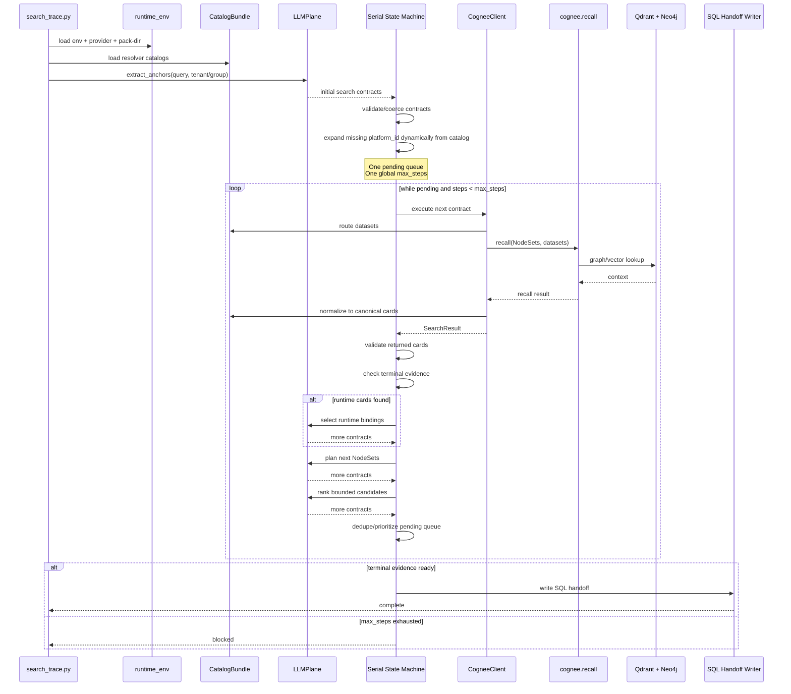
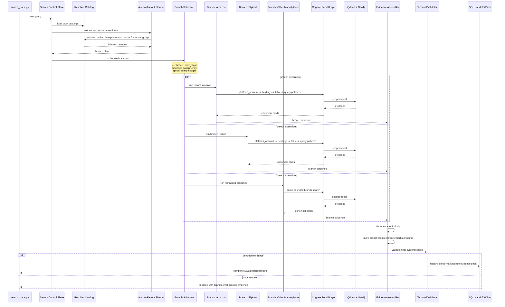

# Constrained Search Swarm Technical Design Documentation

## Summary
Add a new engineering design document at `docs/constrained_search_swarm_design.md`. The doc will explain the current serial constrained-search runtime, the target parallel swarm architecture, latency goals, component responsibilities, interfaces, failure modes, and implementation roadmap.

The design will explicitly state that Cognee is the retrieval substrate, not the native swarm/control-plane engine. The swarm layer will be implemented above Cognee using bounded async branch execution, catalog-driven fanout, and deterministic evidence assembly.

## Key Documentation Content
- Document current state:
  - `search_trace.py` runs a single serial `CogneeSearchStateMachine`.
  - `max_steps` is currently global, so fanout queries like “all marketplaces” exhaust the budget before branch evidence matures.
  - Cognee recall is already async-capable, but branch orchestration is not yet implemented.
- Document target architecture:
  - `QueryIntentCompiler`: turns natural language into structured intent.
  - `RuntimeScopeResolver`: resolves tenant/group/platform-account branches from resolver catalogs without hardcoded marketplace IDs.
  - `BranchScheduler`: runs branches with bounded concurrency and per-branch budgets.
  - `BranchRunner`: resolves one branch from platform account to bindings, tables, columns, query patterns, and metric evidence.
  - `EvidenceAssembler`: merges branch outputs into one normalized evidence pack.
  - `TerminalValidator`: decides complete vs blocked/partial using branch coverage.
  - `SQLHandoffWriter`: emits final handoff from the validated evidence pack.
- Include Mermaid sequence diagrams:
  - Current serial flow.
  - Target swarm flow.
  - Branch execution and fan-in flow.
- Define latency target:
  - Interactive target: P50 under 60s, P90 around 90s.
  - Default v1 controls: `max_parallel_branches=5`, `branch_max_steps=4`, `recall_concurrency=6`, `llm_concurrency=2`, `global_timeout_seconds=90`, `soft_timeout_seconds=70`.
  - Emphasize no per-branch LLM calls in the common path.

## Interfaces And Behavior
- CLI additions to document for future implementation:
  - `--execution-mode serial|swarm`, default `serial` for compatibility.
  - `--branch-max-steps`, `--max-parallel-branches`, `--recall-concurrency`, `--llm-concurrency`.
  - `--global-timeout-seconds`, `--soft-timeout-seconds`.
- Internal model additions to document:
  - `QueryIntent`: analysis type, target entity, metric candidates, source-role preferences, scope.
  - `FanoutPlan`: fanout reason, branch list, budgets, global constraints.
  - `BranchScope`: tenant/group/platform/account/dataset routing.
  - `BranchEvidence`: bindings, tables, semantic cards, status, errors, latency.
  - `SwarmEvidencePack`: merged evidence, branch coverage, final readiness.
- Terminal behavior:
  - Strict default: complete only when every resolved in-scope branch has required sales evidence.
  - If some branches fail or lack evidence, return `blocked_with_partial_evidence` with branch-level reasons.
  - Never silently drop a marketplace branch from an “all marketplaces” query.

## Test Plan
- Unit tests:
  - Catalog-driven fanout returns platform accounts for tenant/group with no hardcoded platform names.
  - Branch budgets are per branch, while global timeout remains a safety fuse.
  - Evidence assembler dedupes canonical IDs and preserves branch lineage.
  - Terminal validator blocks when required branches are missing runtime bindings/table/query-pattern evidence.
- Integration tests:
  - Use the current Mensa marketplace query to verify swarm planning creates one branch per marketplace account.
  - Verify `--llm-dry-run --execution-mode swarm` produces a valid fanout plan without calling Cognee recall.
  - Verify live swarm search writes a trace containing `fanout_plan`, `branches`, `branch_status`, `evidence_pack`, and latency metrics.
- Acceptance criteria:
  - No hardcoded marketplace list.
  - Serial mode remains unchanged.
  - Swarm mode avoids global step exhaustion for 9-marketplace fanout.
  - Target query can either complete with full evidence or block with precise branch-level missing-evidence reasons.

## Assumptions
- Documentation-only change first; no runtime implementation in this step.
- v1 swarm uses bounded async tasks, not OS processes.
- Cognee remains the recall engine; resolver catalogs drive deterministic runtime scope resolution.
- The first implementation target is marketplace fanout, especially “top N selling SKUs across all marketplaces,” but the design should generalize to other fanout scopes later.

## Current Serial Flow

## Target Swarm Flow

